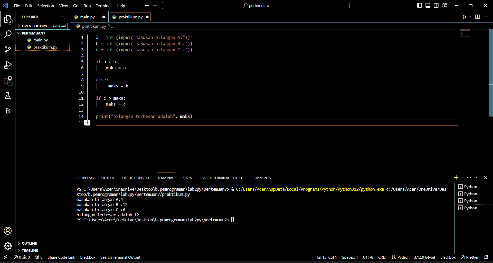

#<h1>buat repository labs2py</h1>

buat file baru dengan nama praktikum.py

coding dengan meng input 3 bilangan

lalu tampilkan bilangan terbesar dari 3 nilai yg sudah kita input menggunakan if dan else

